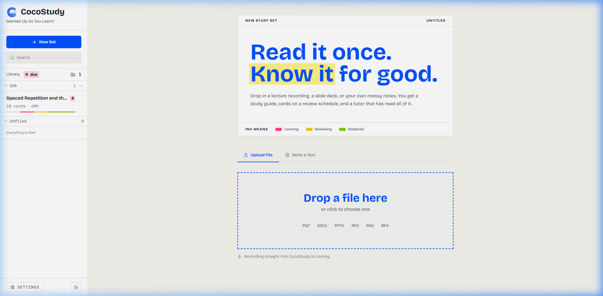
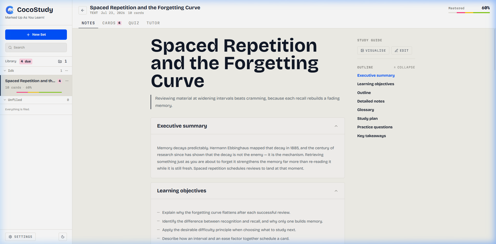
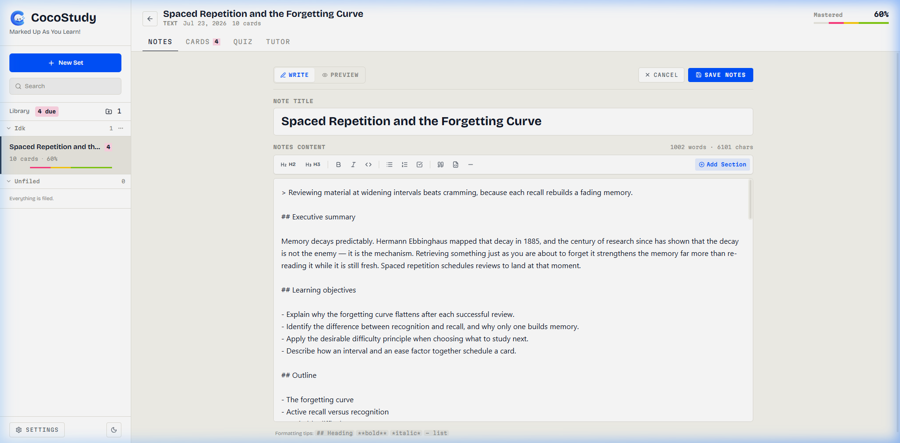
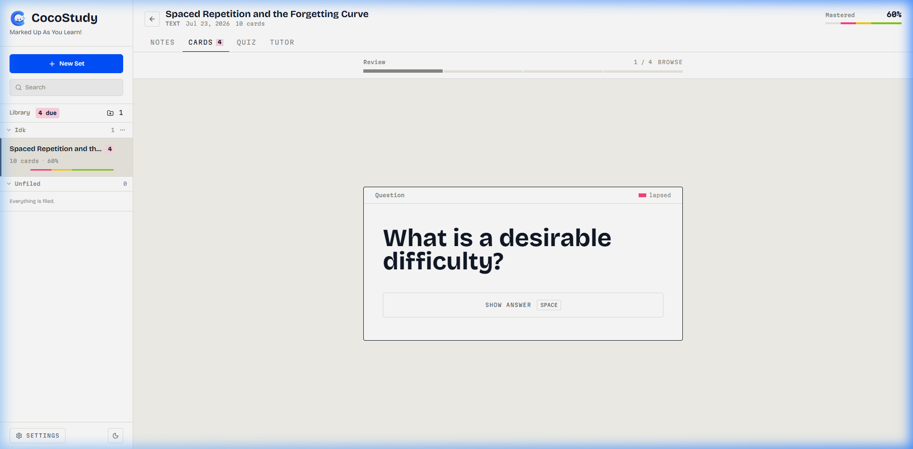
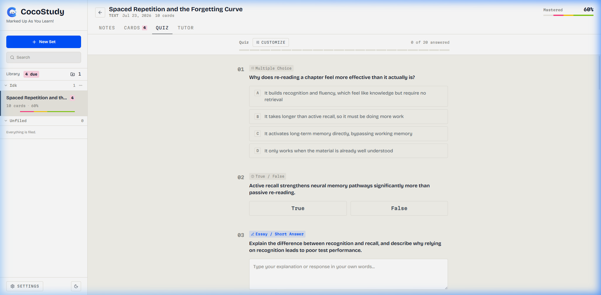
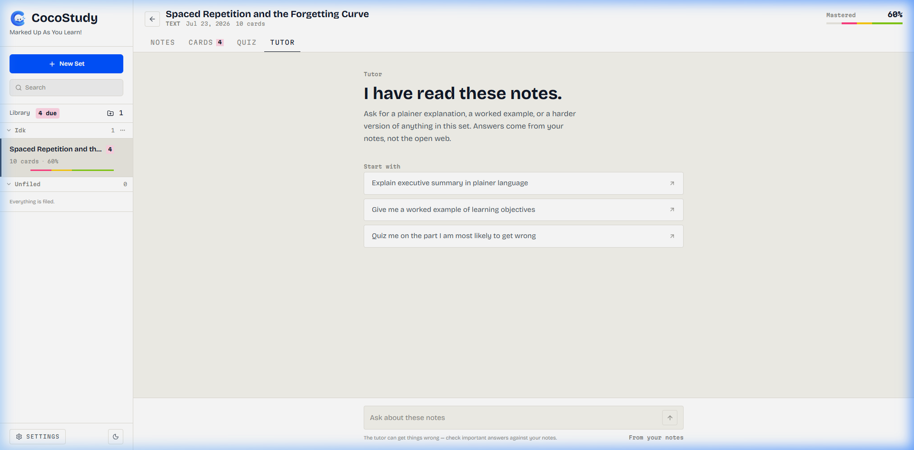
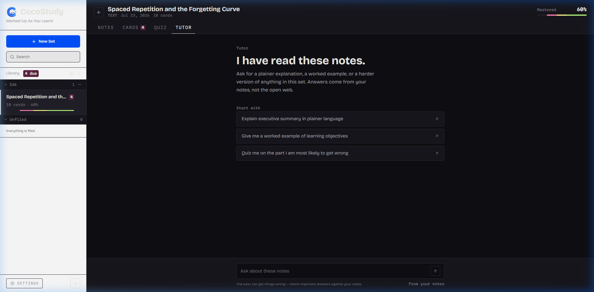

<div align="center">


# CocoStudy

**Marked up as you learn.**

*An AI-powered, offline-first study companion that turns your lectures, slide decks, PDFs, and notes into interactive study guides, spaced repetition flashcards, customizable quizzes, and a personal AI tutor.*

<br />

[](https://cocostudy.vercel.app/)
[](https://react.dev/)
[](https://www.typescriptlang.org/)
[](https://tailwindcss.com/)
[](LICENSE)

<br />



</div>

<br />

## 🌟 Highlights

- **Multi-Format Intake**: Drop in PDFs, Word documents (`.docx`), PowerPoint slide decks (`.pptx`), audio recordings, video lectures, or raw pasted text. Audio/video recordings are automatically transcribed.
- **Smart Study Guides**: Structured notes with auto-generated outlines, collapsible section cards, LaTeX math rendering (`KaTeX`), syntax-highlighted code blocks, and AI illustration visualizers.
- **Rich Notes Editor**: Distraction-free editing with dedicated note title synchronization, full formatting toolbar, markdown shortcuts, word counter, and real-time live preview.
- **Spaced Repetition Flashcards**: Algorithmic SuperMemo SM-2 interval scheduler that calculates optimal review times based on four rating grades (*Again*, *Hard*, *Good*, *Easy*).
- **Customizable AI Quizzes**: Generate custom quizzes with your preferred format mix (Multiple Choice, True/False, Essay), selectable question counts, self-evaluations, and instant retry.
- **Grounded AI Tutor**: A focused conversational tutor that answers strictly from your course material, explains complex concepts simply, and challenges your understanding.
- **100% Private & Offline-First**: All data, flashcards, study sets, and progress are stored entirely inside your browser via IndexedDB. Your Gemini API key never leaves your device.

[**cocostudy.vercel.app**](https://cocostudy.vercel.app/)
---

## 📸 App Showcase

### 1. Interactive Study Guide (Notes)
Structured study notes with a sticky outline table of contents, collapsible section cards, and one-click visual diagrams.



<br />

### 2. Rich Notes Editor & Live Preview
Full-featured markdown editor with heading tools, inline formatting, lists, code blocks, section templates, and side-by-side live preview mode.



<br />

### 3. Spaced Repetition Flashcards
Interactive flashcards with spaced repetition ratings, active recall tracking, and visual mastery bars that update in real-time.



<br />

### 4. Custom Quiz Generator
Customize question types (Multiple Choice, True/False, Essay), adjust question count, get comprehensive explanations for every answer, and retake quizzes with regenerated questions.



<br />

### 5. Grounded AI Tutor
Ask questions, get simpler analogies, test your comprehension, and request practice scenarios from a tutor that has read all your notes.



<br />

### 6. Thoughtful Dark Mode
Hand-crafted paper aesthetics and dark mode designed for high contrast and comfortable late-night study sessions.



**Cards** are generated from the guide, and each one remembers which phrase in your notes it teaches, so the notes highlight themselves as you learn.

**Quiz** is five questions with an explanation for every answer, including the ones you got right. Attempts are kept.

### Quick Start (No Key Required for Demo)
Open the app and click on the pre-loaded demo study set **Spaced Repetition and the Forgetting Curve** to explore all features instantly without an account or API key.

### Using Your Own Material
For generating new study sets from your own files and lectures, add a Google Gemini API key:
1. Get a free API key from [Google AI Studio](https://aistudio.google.com/).
2. Open **Settings** (bottom-left gear icon) in CocoStudy and paste your key.
3. Your key is stored securely in your browser's local storage and only used for direct requests to Google's API.

Four grades: again, hard, good, easy. Each card has an ease factor starting at 2.5 that drifts between 1.3 and 2.8 depending on how you answer. Get one wrong and it comes back in ten minutes, not tomorrow. Intervals grow from there and stop at a year.

## 💻 Local Development

### Prerequisites
- **Node.js**: v18.0.0 or higher
- **npm** or **pnpm** / **yarn**

### Installation

```bash
# 1. Clone the repository
git clone https://github.com/your-username/cocostudy.git
cd cocostudy

# 2. Install dependencies
npm install

# 3. Start the development server
npm run dev
```

Visit `http://localhost:5173` in your browser.

### Scripts

| Command | Description |
| :--- | :--- |
| `npm run dev` | Starts Vite local development server |
| `npm test` | Runs Vitest unit test suite |
| `npm run build` | Type-checks with `tsc` and creates production bundle |
| `npm run preview` | Previews the production build locally |

The bar under each set in the sidebar is the whole deck in those inks, so you can read the state of a set without opening it.

## 🧠 How Spaced Repetition Works

CocoStudy implements an adaptive SM-2 spaced repetition algorithm:

- **Ease Factor**: Each card starts with an ease factor of `2.5` that dynamically adjusts between `1.3` and `2.8` based on your recall speed and accuracy.
- **Interval Growth**: Successful reviews lengthen intervals exponentially; lapses reset the card to a 10-minute learning step.
- **Colour Mastery Progress**:

| Color | Status | Description |
| :--- | :--- | :--- |
| **Bare Graphite** | Unseen | Card has not been reviewed yet |
| **Pink** | Learning | Card was recently failed or is in the initial learning phase |
| **Yellow** | In Review | Card is scheduled with increasing daily intervals |
| **Green** | Mastered | Card has reached long-term memory mastery (interval ≥ 21 days) |

---

## 🛠️ Technology Stack

- **Frontend**: React 19, TypeScript, Vite
- **Styling**: Tailwind CSS v4, Vanilla CSS Custom Properties
- **Typography**: Bricolage Grotesque (Display), Source Serif 4 (Body), Martian Mono (Code & Data)
- **Document Processing**: `mammoth` (DOCX), `jszip` (PPTX), Native PDF text extraction, Web Audio API
- **Markdown & Math**: `react-markdown`, `remark-gfm`, `remark-math`, `rehype-katex`, `KaTeX`
- **Database & Storage**: `idb` (IndexedDB browser database)
- **AI Models**: Google Gemini 2.5 Flash / Pro via `@google/genai`
- **Testing**: Vitest, React Testing Library

## Your data

All of it lives in IndexedDB on your machine. No account, no upload, and closing the tab costs you nothing.

Settings exports a JSON file of every set and all your progress, minus the API key, on the theory that an export is a thing people email to themselves. There's also a wipe.

## Built with

React 19, TypeScript, Tailwind v4, Vite. GSAP for motion, react-markdown with remark-gfm and KaTeX, idb for storage, mammoth and jszip for reading documents, Gemini for generation.

Bricolage Grotesque for display, Source Serif 4 for reading, Martian Mono for anything that's data or a label. Light and dark are both chosen, never inherited from the OS.

## License

## 🔒 Privacy & Data Sovereignty

- **Zero Cloud Tracking**: All study sets, notes, flashcards, folders, and statistics reside in your browser's IndexedDB.
- **Full Data Portability**: Export your complete library as a JSON backup at any time from Settings, or import previously saved backups.
- **Direct API Communication**: AI calls communicate directly with Google's API endpoints using your personal key—no intermediate proxy servers.

---

## 📄 License

Distributed under the MIT License. See [`LICENSE`](LICENSE) for more details.
